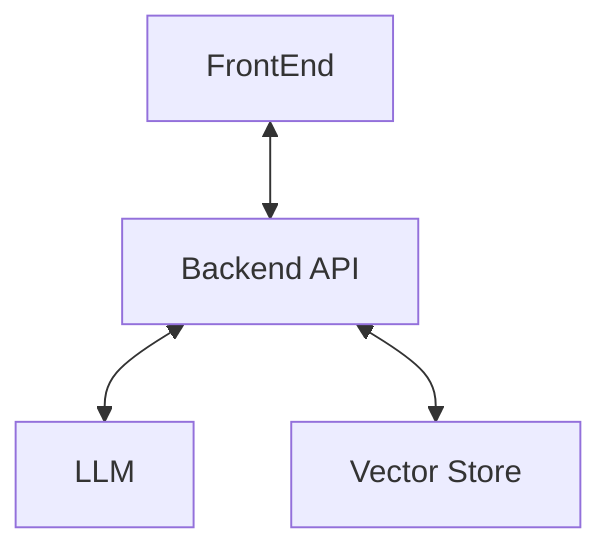

# Trust Assembly Headline API

A Deno API for analyzing limbic-hacking headlines and replacing them with
more trustworthy ones.

This API uses Deno, Hono, Postgres, and LLMs

## Getting Started

```
deno task start # this will start the server listening on 0.0.0.0:8000
```

# Architecture


# Backend API
Receives from the front-end some content plus a headline. It looks up in the
Vector Store if there's already a headline for that content (eg has a high
cosine similarity for the content). If so, return the headline that was
already previously generated (this will dedup across many stories). If not,
then generate one via LLM and put it into the Vector Store.

# Vector Store
Unless there are objections, try Postgres with vector extension.

# LLM
Unless there are objections, try Mixtral 8x7b or, if we are flush with cash,
Mixtral 8x22b. Or, if 8x7b is too heavyweight, perhaps Llama3 or some other
SOTA frontier model.
