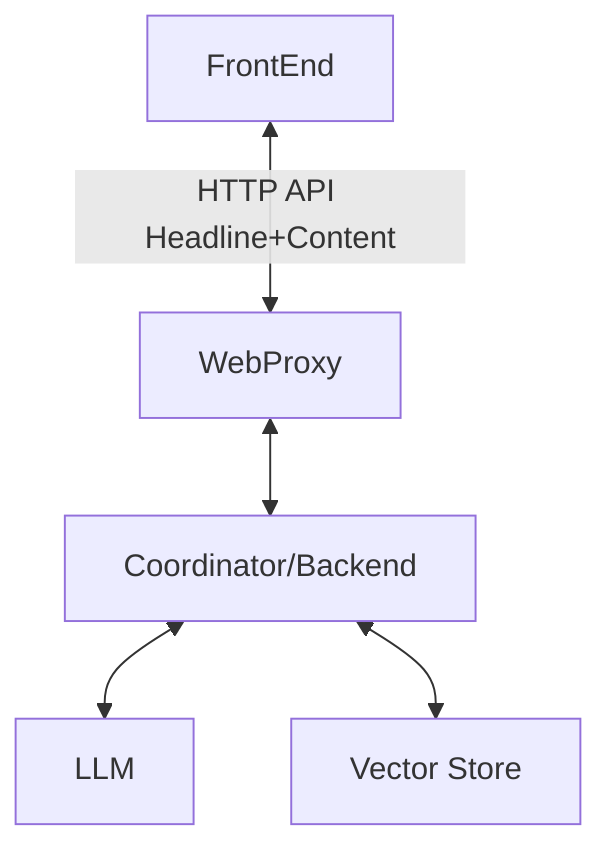

# Back-End
The Trust Assembly back-end is responsible for taking a URL, returning a headline.

# Architecture

# Coordinator
Receives from the front-end some content plus a headline. It looks up
in the Vector Store if there's already a headline for that content. If so,
return it (this will dedup across many stories). If not, then generate one
via LLM and put it into the Vector Store.

# Vector Store
Unless there are objections, try Postgres with vector extension.

# LLM
Unless there are objections, try Mixtral 8x7b or, if we are flush with cash,
Mixtral 8x22b. Or, if 8x7b is too heavyweight, perhaps Llama2 7b.
