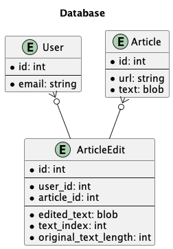
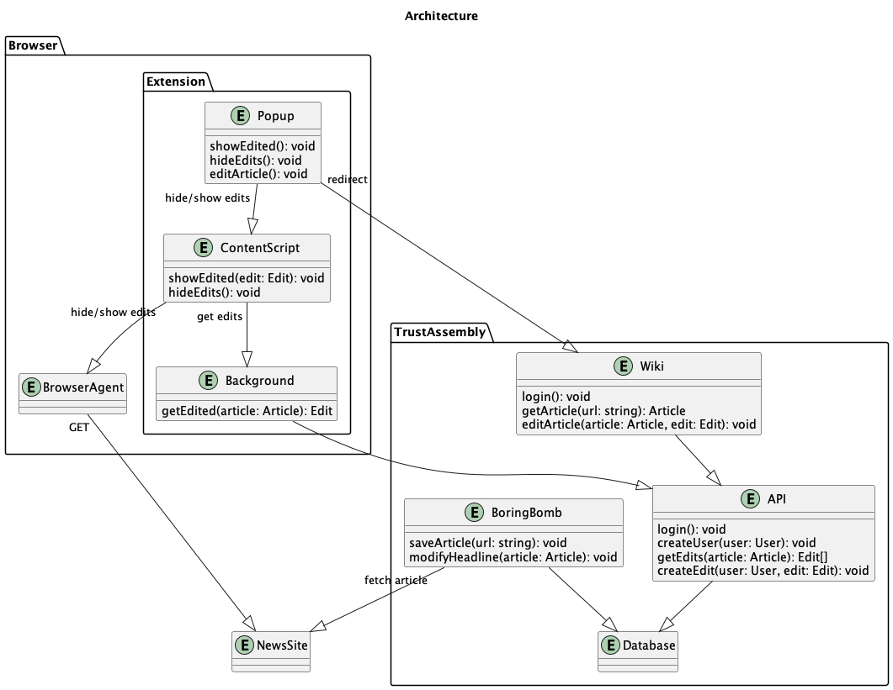

# Proposed Architecture

## Overview

First pass at the architecture of the system.

## Relational Database Model

If we want to go with a relational database, something like this may be how we would want to model it.

Missing some kind of reputation system

## Entity Architecture

## Extension

The extension should enable users to view edits and link to the wiki.

## Trust Assembly

### API

The API should be relatively simple. It should be able to handle the following requests:

- Login user
- Create a user
- Get article with edits
- Create an edit

Both the extension and wiki should be able to use this API.

### Wiki

The front end for Trust Assembly. Enable users to view articles with edits and create their own edits.

### Boring Bomb

A worker/job that will parse articles from URLs and save them to the database. Also will generate edits (via AI or something) and udpate the database.

### Stray notes

Will likely need to handle edits on articles that have been updated since the edit was made. Integrating with something like [jsdiff](https://github.com/kpdecker/jsdiff) may be worth looking into.
