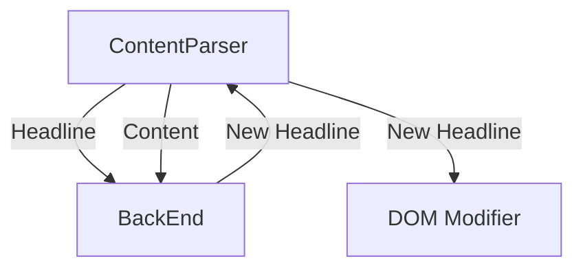

# UI
This will be where we put the UI to view trust-assembly content, as well as the browser-extension that transforms users' media feed.

# Vision
As someone browses the web, the headline is replaced with a better version as
determined by the Trust Assembly back-end.

# Architecture

The front-end (browser-plugin?) will be responsible to grab the headline and as
much content as will fit in a fixed size (2kb?) as possible (eg 1st 1kb and last
1kb of present article) and send to the backend for processing.

Back-end will return a better headline (and in the future annotations on the content as well).

## TODO

* [ ] Initialize Extension Project:
    * [ ] Set up project structure with TypeScript support.
    * [ ] Configure manifest files for Chrome and Safari compatibility.
* [ ] Content Scripts:
    * [ ] Write scripts to scan webpages for headlines.
    * [ ] Use DOM manipulation to replace headlines with transformed versions.
* [ ] API Integration:
    * [ ] Fetch transformed headlines from the backend API.
    * [ ] Implement caching to reduce network requests.
* [ ] User Interface:
    * [ ] Add options or context menus for users to toggle between original and transformed headlines.
    * [ ] Handle permissions and content security policies.
* [ ] Cross-Browser Support:
    * [ ] Use WebExtension APIs for compatibility.
    * [ ] Test and adjust manifest files and APIs for both Chrome and Safari.
