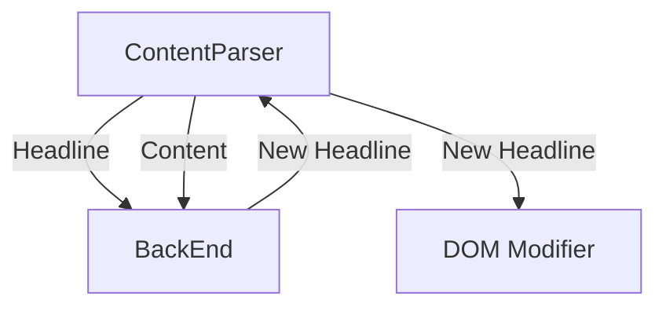

# UI
This will be where we put the UI and info about it.

# Vision
As someone browses the web, the headline is replaced with a better version as
determined by the Trust Assembly back-end.

# Architecture

The front-end (browser-plugin?) will be responsible to grab the headline and as
much content as will fit in a fixed size (2kb?) as possible (eg 1st 1kb and last
1kb of present article) and send to the backend for processing.

Back-end will return a better headline (and in the future annotations on the content as well).
