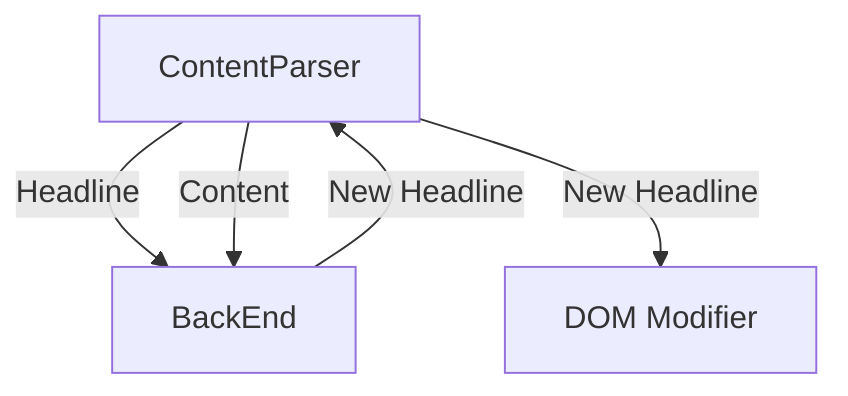

# browser-extension

This is the browser-extension that transforms users' media feed.

## Vision

As someone browses the web, the headline is replaced with a better version as
determined by the Trust Assembly back-end.

## Project Structure

* `src/`: Contains browser extension TypeScript source files.
* `dist/`: Will contain the compiled JavaScript files.
* `icons/`: Stores icon images for the extension.
* `manifest.json`: Defines the extension's configuration.

## Getting Started

```bash
# you only need to run the install command once before building
npm install

#builds and runs chrome in debug mode
npm run dev

#builds everything
npm run build
```

### Quick Test of the Extension

#### Load the Extension into Chrome
npm run dev

#### Load the Extension into IE
npm run start

#### Load the Extension into Firefox
#firefox requires extra steps compared to chrome and edge

#DO these steps once before building
#set up certs firefox if you have it
npx -y mkcert-cli --outDir node_modules\extension-develop\dist\certs --cert localhost.cert --key localhost.key
#note: you may need to create the certs folder manually.
#note: if the node_modules\extension-develop\dist folder isn't there already, run: 'npm run build' first.


#to build and load the extension
1.npm run build
2. open: about:debugging#/runtime/this-firefox
3. Click: Load Temporary Add-on...
4. Select the browser-extension directory.
	* trust-assembly\ui\browser-extension\dist\firefox
	* click on any file in the directory
5. Verify Extension Installation
    * The extension should now appear in your list with the name "Headline Stylistic Transformer".
    * Ensure there are no errors during loading.


#### Test the Extension

1. Content Script Verification
    * Open any website (e.g., https://www.example.com).
    * Open the Chrome Developer Tools (F12 or Cmd+Option+I on Mac).
    * Go to the Console tab.
    * Look for the message: "Headline Stylistic Transformer content script loaded."
2. Background Script Verification
    * In the Extensions page (chrome://extensions/), click on Service Worker under your extension to open the background service worker console.
    * Check for the message: "Headline Stylistic Transformer background service worker loaded."
3. Popup Verification
    * Click on the extension's icon in the toolbar.
    * The popup should display with the heading "Transformer" and a button labeled "Toggle Transformation".

## Architecture



The front-end (browser-plugin?) will be responsible to grab the headline and as
much content as will fit in a fixed size (2kb?) as possible (eg 1st 1kb and last
1kb of present article) and send to the backend for processing.

Back-end will return a better headline (and in the future annotations on the content as well).

## TODO (Browser Extension)

* [X] Initialize Extension Project:
    * [X] Set up project structure with TypeScript support.
    * [X] Configure manifest files for Chrome...
    * [ ] ...and Safari compatibility.
* [ ] Content Scripts:
    * [X] Write scripts to scan webpages for headlines.
    * [X] Use DOM manipulation to replace headlines with transformed versions.
    * [X] Allow user to click on transformed headline to switch back to original.
* [ ] API Integration:
    * [X] purchase domain name for backend (trust-assembly.org)
    * [ ] Implement API calls to the backend for headline transformation.
    * [ ] Fetch transformed headlines from the backend API.
    * [ ] Implement caching to reduce network requests.
* [ ] User Interface:
    * [ ] Add options or context menus for users to toggle between original and transformed headlines.
    * [ ] Handle permissions and content security policies.
* [ ] Cross-Browser Support:
    * [ ] Use WebExtension APIs for compatibility.
    * [ ] Test and adjust manifest files and APIs for both Chrome and Safari and Firefox.

### Notes for Safari Extension Integration:

Safari extensions require you to package your WebExtension using Xcode:

1. Install Xcode: Make sure you have Xcode installed on your Mac.
2. Create a New Safari Web Extension Project:
    * Open Xcode.
    * Select File > New > Project.
    * Choose Safari Web Extension under the macOS tab.
3. Import Your Existing Extension:
    * During setup, Xcode will ask if you want to Use an existing extension.
    * Point it to your manifest.json file.
4. Build and Run:
    * Xcode will create a container app and the Safari extension.
    * You can build and run the project to test the extension in Safari.

Note: Safari's extension APIs are similar but may have some differences. Testing is essential to ensure compatibility.
